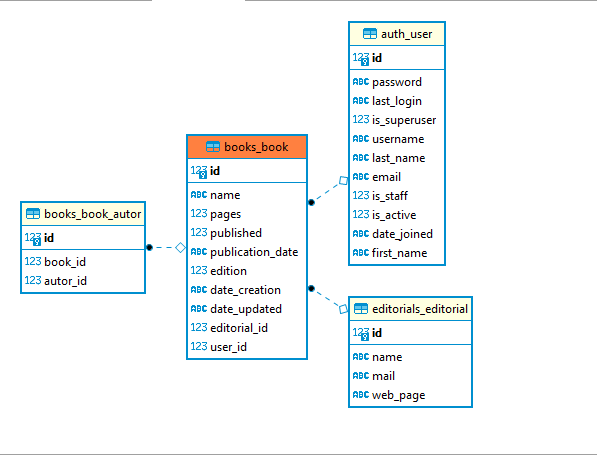

# Library

API de libreria donde relaciona los autores y editoriales de los libros 


## Instalación
### Instalar Python 3:
- Checar la liga de descarga https://www.python.org/downloads/

#### Crear entorno virtual:
- Ir al directorio de tu proyecto, usar la consola y correr el siguiente comando 
```shell
> python3 -m venv env
``` 
- Para activar entorno virtual
```shell
> source env/bin/activate
```

#### Instalar requerimientos:
```shell
> pip install -r requirements.txt
```

#### Mode lo entidad relación



## Correr API Server
```shell
> python manage.py runserver
```
## Lista de Request de Postman


- [Library Colección de la Api](https://github.com/ubaldoesp/Library/tree/main/postman)

## Tests

```shell
> coverage run --source='.' manage.py test
```
```shell
> coverage report
```


## Ejemplo de la Api corriendo

- List | Books


- Create | Books


- Update | Books


## Admin Panel
- http://127.0.0.1:8090/admin

Las operaciones básicas de CRUD también se pueden realizar desde la interfaz de administración de Django y Django Rest Framework.


- http://127.0.0.1:8090/books/
- http://127.0.0.1:8090/autors/
- http://127.0.0.1:8090/editorials/
